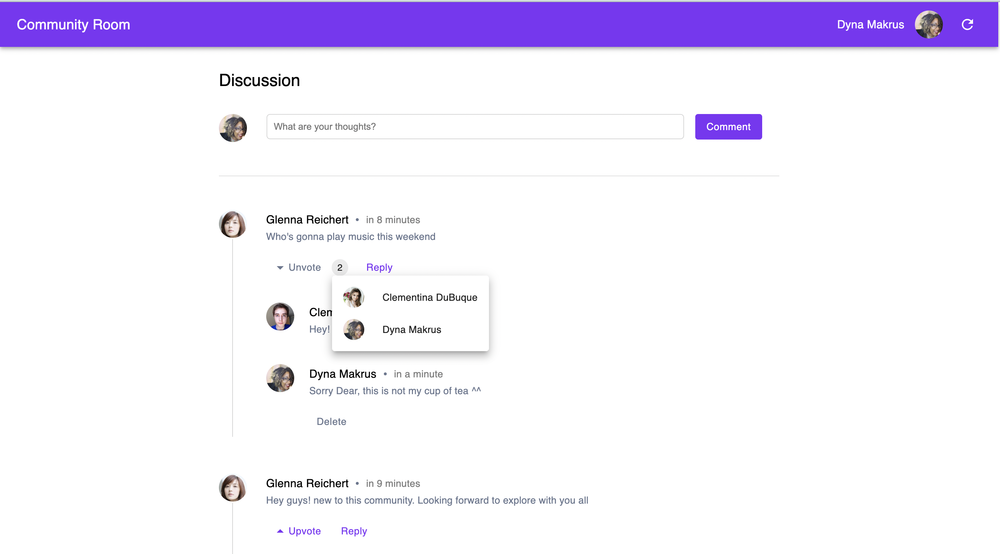

# Community Room

This is a community room discussion panel where basically different users can add their comments and other users can react to their comments.

## Live Link

[Community Discussion - Netlify](https://community-discussion.netlify.app/)

## Project Snap

## Features

- Generates random users
  - user generates on click of refresh button
  - user generates on page refresh
- Generated user can add a comments
  - Comment get added on press of enter
  - Comment get added on click of comment button
  - User gets a notification when comment added
- Everytime user adds a comment, the comment will appear in comment seciton and get stored. Hence the comments do not get removed on page refersh.
- Each comment has some actions
  - Upvote and Unvote
  - See users who upvoted
  - Reply to the comment
  - Delete the comment
- The user who added the comment can
  - Delete the comment
  - Can see who upvoted the comment
  - Can not upvote the comment. Upvote is disabled for the creator.
- Other users except the commentor can
  - Upvote a comment
  - Unvote their upvote
  - See who have upvoted
  - Reply to the comment
  - Can not delete any other's comment
- Replies get rendered below each comment. Only the creator can delete the reply to a specific comment.
- Comments will get rendered according to the upvotes they have. The comment with more upvotes will get rendered first.
- The interface is responsive for mobile screen

## Tools and Concepts Used

- React hooks
- CSS
- Material UI
- UUID
- Context API
- Locale Storage
- Moment JS
